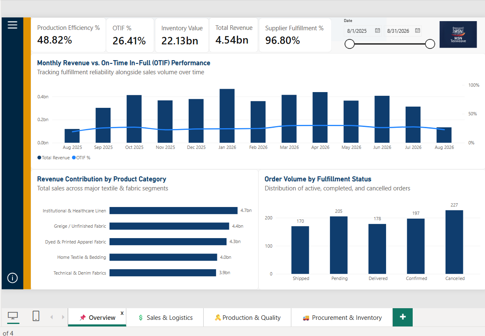

# TexWeave — Business Analytics Dashboard

**Team Nexus | MSN Academy × Novik Edge Virtual Internship Program**

A business analytics solution for a textile manufacturing business, combining **SQL data management, data validation/reconciliation, and an interactive Power BI dashboard** across procurement, production, inventory, sales, quality, and logistics.

## 📊 Project Overview

TexWeave was developed as a team-based analytics project to turn operational textile-business data into a structured reporting and decision-support solution.

The project covers six major data domains:

- Products & Inventory
- Suppliers & Raw Materials
- Procurement & Purchasing
- Manufacturing & Production
- Commercial Sales & Shipments
- Master Lookups & Standards

The solution follows a flow from **source data → SQL layer → validation/reconciliation → Power BI model → interactive dashboard**.

## 🛠️ Tools & Technologies

- **Microsoft SQL Server** — database schema, data layer, views, KPIs, triggers, audit logging, and verification queries
- **Power BI** — data modeling, DAX measures, dashboard design, bookmarks, navigation, and slicers
- **Microsoft Excel** — source datasets and benchmark/reconciliation values
- **SQL** — data validation, analytical queries, reconciliation, and testing

## 📈 Dashboard

The Power BI dashboard uses a single-canvas design with bookmark-based navigation across five analytical views:

1. **Overview**
2. **Sales & Logistics**
3. **Production & Quality**
4. **Procurement & Suppliers**
5. **Inventory & Warehouse**

Key metrics include:

- Total Revenue
- OTIF % (On-Time In-Full)
- Production Efficiency %
- Batch Defect Rate %
- Supplier Fulfillment %
- Inventory Value
- Total Wastage Quantity
- Other operational and commercial KPIs

## 🔍 Data Validation & QA

The final project included reconciliation between the cleaned Excel source data, SQL-reconciled values, and Power BI calculations.

The final QA report documents **37 reconciliation checks**, with all checks passing and no variance reported across the tested SUM/COUNT metrics and selected DAX benchmarks.

Dashboard QA also covered:

- Bookmark/view switching
- Persistent navigation and slicer behavior
- DAX measure validation
- Model relationships
- Date filtering
- SQL/Excel/Power BI value tie-out

## 📁 Repository Contents

| File / Folder | Description |
|---|---|
| `TexWeave Dashboard.pbix` | Interactive Power BI dashboard and data model |
| `TexWeave_TeamNexus.sql` | Main SQL project script |
| `01_TexWeave schema.sql` | Database schema setup |
| `01_Triggers_and_UAT.sql` | Triggers and user acceptance testing scripts |
| `02_Verification_Tests.sql` | Verification and validation queries |
| `Views_and_KPI.sql` | Analytical views and KPI queries |
| `Commercial Sales and Shipments.xlsx` | Commercial sales and shipment source data |
| `Manufacturing_and_Production.xlsx` | Manufacturing and production data |
| `Procurement_and_Purchasing.xlsx` | Procurement and purchasing data |
| `Products_and_Finished_Inventory.xlsx` | Product and finished inventory data |
| `Suppliers and Raw Materials.xlsx` | Supplier and raw-material data |
| `Master_Lookups_and_Standards.xlsx` | Lookup/reference data |
| `01_Data_Profiling_Report.pdf` | Data profiling documentation |
| `03_TexWeave_Report.docx` | Final reconciliation and QA report |
| `02_TexWeave_ER_Diagram.jpeg` | Entity-relationship diagram |
| `Overview.png` | Dashboard overview screenshot |
| `Page Navigation.png` | Dashboard navigation screenshot |
| `Procurement & Inventory.png` | Procurement/inventory dashboard screenshot |
| `Production & Quality.png` | Production/quality dashboard screenshot |
| `Sales & Logistics.png` | Sales/logistics dashboard screenshot |

## 🖼️ Dashboard Preview

### Overview

### Sales & Logistics

### Production & Quality

### Procurement & Inventory

## 🚀 How to Use

### SQL

1. Open **SQL Server Management Studio (SSMS)**.
2. Create/select the required database.
3. Run `01_TexWeave schema.sql` to create the database structure.
4. Use the main SQL scripts and supporting scripts for views, KPIs, triggers, and verification.
5. Review the verification scripts to validate the resulting data.

### Power BI

1. Open `TexWeave Dashboard.pbix` in Power BI Desktop.
2. Review the model and relationships.
3. Use the dashboard navigation/bookmarks to move between analytical views.
4. Use the available slicers to interact with the dashboard.

> **Note:** The PBIX may depend on the original local data/model environment used during development. If Power BI prompts for data-source credentials or paths, update the source settings accordingly.

## 🎯 Project Outcome

The completed solution demonstrates how operational business data can be structured, validated, analyzed, and presented through a combination of **SQL and Power BI**. The project also includes documented reconciliation and dashboard QA to support confidence in the reported metrics.

## 👥 Project

**Team Nexus**  
Developed as part of the **MSN Academy × Novik Edge Virtual Internship Program**.

---

*This repository is intended as a portfolio/project showcase and contains the project artifacts used during development and final validation.*
